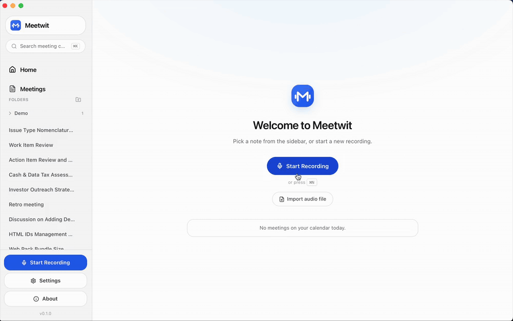

# Meetwit

> Privacy-first, local-first AI meeting assistant for macOS.

Meetwit listens to your live meetings, indexes your local company documents, and
answers questions in real time using both — with sources. It detects conflicts
between what's being discussed and what your company has already decided.

**Everything runs locally on your Mac. Nothing leaves.** No accounts, no
telemetry, no cloud — the app talks only to `localhost`.

<!--
  Demo: drop a screen recording into assets/demo.gif (see assets/make-demo-gif.sh)
  then uncomment the block below.

<p align="center">
  
</p>
-->

---

## What makes it different

Most meeting assistants transcribe what was *said*. Meetwit also understands what
your **company** has already *decided*, so it can:

1. **Index** local company documents (PDF, DOCX, Markdown, TXT)
2. **Listen** to live meetings (mic + system audio) and produce a real-time transcript
3. **Answer** questions during the meeting using your docs + meeting history, with sources
4. **Detect** conflicts between meeting content and your company knowledge
5. **Save** summaries, decisions, and action items for cross-meeting search

## Features

- **Live transcription** — mic + system audio, on-device Whisper (Metal GPU)
- **Multilingual** — transcribe in any language; write summaries in any language, independent of the spoken one
- **In-meeting copilot** — ask questions during the call, grounded in your docs + transcript, with citations
- **Live notes** — jot timestamped notes while recording
- **Summaries, decisions & action items** — generated locally after the meeting
- **Cross-meeting memory** — semantic search across every meeting and document
- **Conflict detection** — flags when a new decision contradicts a past one
- **Organize** — nest meetings in folders, merge interrupted sessions
- **Import audio** — transcribe an existing recording
- **Export** — Markdown, PDF, plain text, WebVTT, SRT, JSON
- **Bring your own model** — local Ollama by default; optional OpenAI / Anthropic / Groq / OpenRouter (keys stay in the macOS Keychain)

## Privacy

By default, **zero outbound network requests**. The app talks only to:

- `localhost:5167` — the auto-spawned local Python sidecar
- `localhost:11434` — your local Ollama install

No analytics, no crash reporting, no accounts. Your meetings, transcripts, and
recordings never touch a network. There's no telemetry to opt out of — there's
none to begin with, and you can verify that in the source.

## Install

1. Download the latest `Meetwit_*_aarch64.dmg` from the
   [Releases](https://github.com/emretheus/meetwit/releases/latest) page.
2. Open the `.dmg` and drag **Meetwit** to your Applications folder.
3. Launch it. macOS will ask for **Microphone** and **Screen Recording**
   permission — both are needed to capture your side of the call and the other
   participants' audio.

Releases are **signed with a Developer ID and notarized by Apple**, so the app
opens normally — no "unidentified developer" warning, no security workaround.
You can verify your download against the `SHA-256` published in the release.

## Requirements

- macOS 13+ on Apple Silicon (M1 or later)
- [Ollama](https://ollama.com) (for local LLM inference)
- ~3 GB free disk for the Whisper + embedding models

## Tech stack

| Layer | Stack |
|---|---|
| Desktop shell | Tauri 2 + Rust + React 19 + TypeScript + Tailwind 4 |
| Speech-to-text | whisper-rs (Metal) |
| Audio | ScreenCaptureKit (system) + cpal (mic) |
| Backend | FastAPI + SQLite + sqlite-vec (auto-spawned sidecar) |
| Embeddings | BGE-M3 (multilingual) |
| LLM | Ollama (local) or BYOK cloud providers |

## Build from source

Prerequisites: `rustup`, Node 22 (via `nvm`), `uv`, `pnpm`, `cmake`.

```bash
./scripts/bootstrap.sh
pnpm tauri:dev
```

Release build (`.app` + `.dmg`):

```bash
./scripts/build-release.sh
```

## Contributing

Issues and pull requests are welcome. Please open an issue to discuss larger
changes before starting.

## License

[MIT](./LICENSE).
